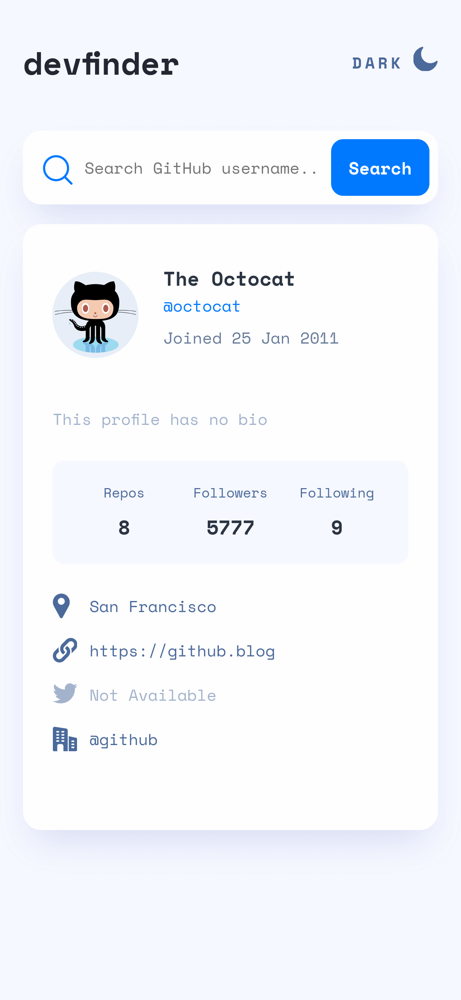
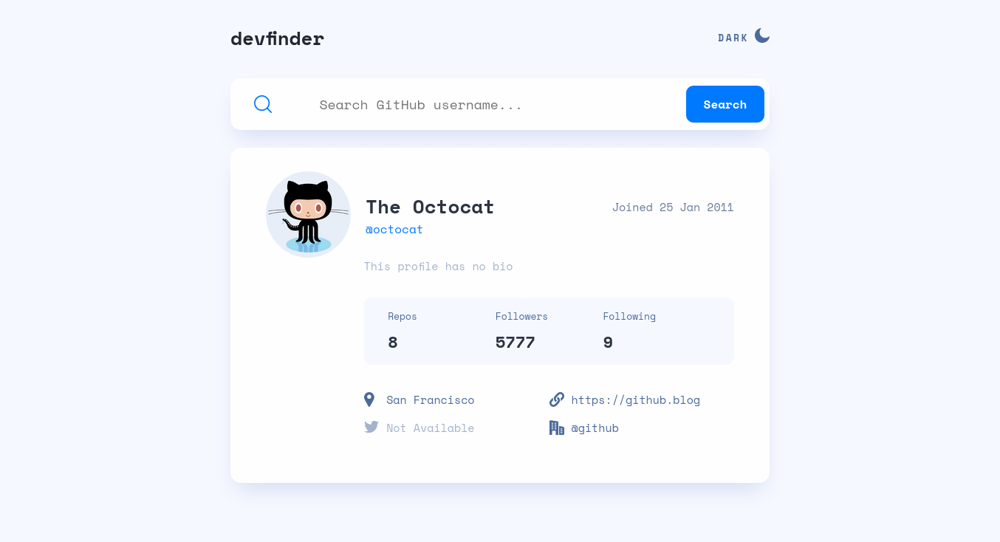

# Frontend Mentor - GitHub user search app solution

This is a solution to the [GitHub user search app challenge on Frontend Mentor](https://www.frontendmentor.io/challenges/github-user-search-app-Q09YOgaH6). Frontend Mentor challenges help you improve your coding skills by building realistic projects.

## Table of contents

- [Frontend Mentor - GitHub user search app solution](#frontend-mentor---github-user-search-app-solution)
  - [Table of contents](#table-of-contents)
  - [Overview](#overview)
    - [The challenge](#the-challenge)
    - [Screenshot](#screenshot)
    - [Links](#links)
  - [My process](#my-process)
    - [Built with](#built-with)
    - [What I learned](#what-i-learned)
    - [Continued development](#continued-development)
    - [Useful resources](#useful-resources)
  - [Author](#author)

## Overview

### The challenge

Users should be able to:

- View the optimal layout for the app depending on their device's screen size
- See hover states for all interactive elements on the page
- Search for GitHub users by their username
- See relevant user information based on their search
- Switch between light and dark themes

### Screenshot





### Links

- Solution URL: [Add solution URL here](https://your-solution-url.com)
- Live Site URL: [Add live site URL here](https://your-live-site-url.com)

## My process

### Built with

- Semantic HTML5 markup
- CSS custom properties
- Flexbox
- CSS Grid
- Mobile-first workflow
- [React](https://reactjs.org/) - JS library
- [Styled Components](https://styled-components.com/) - For styles

CONTEXT API - STYLED COMPONENTS (DARK MODE - DINAMIC STYLES)

### What I learned

- State management with Context Api, so that child components can access the global state, avoiding the sending of props by intermediate (parent) components. Having a single global state also makes it simpler to update its properties based on a user action.

```js
//Create a new context
const MyContext = React.createContext(defaultValue);

/*each Context has a Provider where it supplies
the content of the Prop "value" to each of its child components*/
<MyContext.Provider value={/* some value */}>
```

- each Context has a Provider where it supplies the content of the Prop "value" to each of its child components

```js
const Search = styled.form`
  width: 100%;
  height: 60px;
  border-radius: 15px;
  display: flex;
  justify-content: space-between;
  align-items: center;
  cursor: pointer;
  ${(props) =>
    props.darkMode
      ? css`
          background-color: var(--purple-dark);
        `
      : css`
          background-color: var(--white-light);
          box-shadow: 0px 16px 30px -10px rgba(70, 96, 187, 0.2);
        `}
  @media (min-width: 1024px) {
    height: 70px;
  }
`;
```

### Continued development

- Continue learning Next JS (React Framework) enabling Server-Side Rendering
- Folder structure for more complex projects and best coding practices when handling larger React workflows

### Useful resources

- [Context Api React JS](https://reactjs.org/docs/context.html) - This documentation about Context API from the official React website helped me to know how to use the different functionalities and their respective calls.
- [Styled Components](https://styled-components.com/) - Step-by-step guide to manage styles within JS, style depending on the Prop, and apply animations to components.

## Author

- GitHub - [Jhoan Sebastian Perez](https://github.com/jhoanSebasPerez)
- Frontend Mentor - [@jhoanSebasPerez](https://www.frontendmentor.io/profile/jhoanSebasPerez)
- Twitter - [@JhoanPerezA0](https://twitter.com/JhoanPerezA0)
